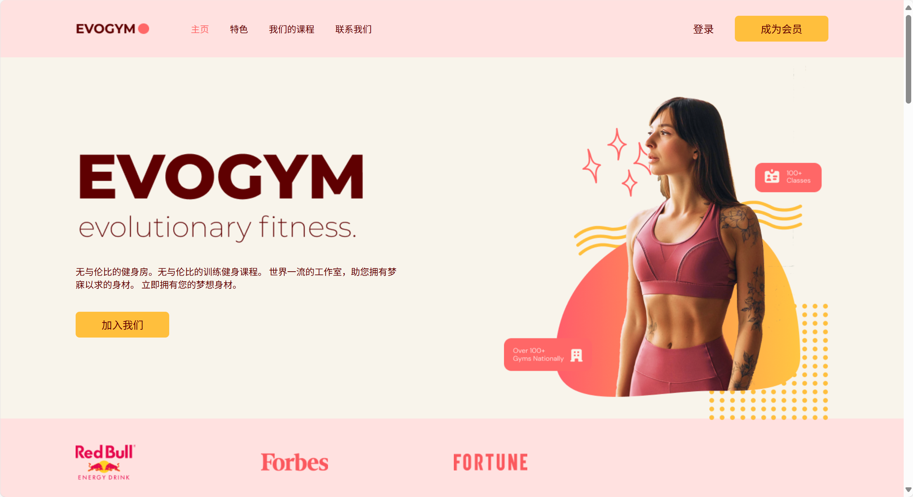
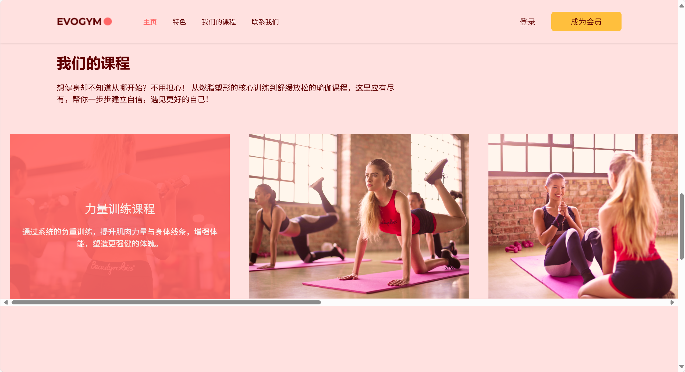

# 健身房主页项目

这是一个使用`React` + `TypeScript` + `Vite`构建的健身房主页。

## 技术栈

React + Typescript + Vite + Tailwind CSS 等

## 主页展示



## 课程选择



## 项目结构

```
gym-ts-proj/
 └ src/
    └ components/      # UI 组成
    └ hooks/            # 自定义 Hook
    └ pages/            # 项目页面
    └ assets/            # 项目资源
    └ App.tsx
    └ main.tsx
 └ public/
 └ index.html
 └ vite.config.js
 └ package.json
 └ ts.config.json
 └ tailwind.config.js
```

## 学习成果

- 掌握了 `Typescript` 的基本使用
- 使用 `Tailwind CSS` 加快了项目样式开发
- 加深了对响应式设计的理解

## 联系

由 @vertin5015 创建 - 欢迎联系！
